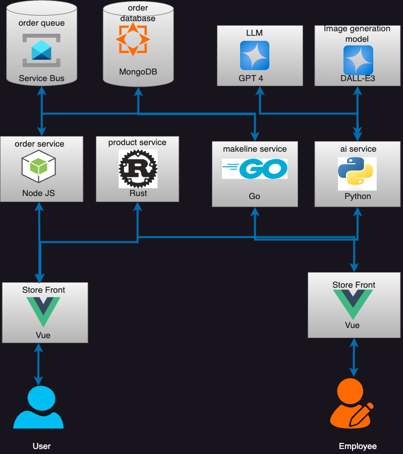

# CatherineDaigle_CloudNative_41175118_Assignment2
 Its the main repository that lists all the files and workflow


# Updated Application Architecture:



# Application and Architecture Explanation:
The Architecture above is similar to the Algonquin petstore, however the only difference being that rabbitmq is replaced with Azure Service Bus as a Queuing system.  Each service remains the same although some edits were made to fit Bestbuys aesthetic and purpose.  For example, Product Service's data.rs has been changed to feature tech products.  ai-service description_generator.py and image_generator.py was changed to fit descriptions to tech products.  Lastly, the store front and store admin webpage and styles changed to fit Bestbuy.


# Deployment Instructions:

## Setting up AKS
Step 1: Create AKS
- Region: Canada Central
- AKS Pricing: Free
- Automatic Upgrade: Disabled
- Node Security Channel Type: None
- Authentication and Authorization: Local accounts with Kubernetes RBAC

Step 2: Create Nodes:
- masterpool node, D2as V4 with Manual scaling set to 1 Node
- workerpool node, mode: user, D2as V4 with manual scaling set to 1 node (saving costs)

Step 3: Review & Create

Step4: Connect to kubernetes:
```
az account set --subscription 80a95cf9-65b4-4bbe-9645-ce60c00e7572
az aks get-credentials --resource-group CloudNativeA2 --name BestBuyCluster --overwrite-existing
```

### Getting the Kube config
Step1: 
```cat ~/.kube/config | base64 -b 0 > kube_config_base64.txt``` (-b is for mac, use -w for windows)

Step2: 
- Apply the kubconfig to each KUBE_CONFIG_DATA secret in the secrets and variables.

## Setting up Azure Service Bus:
Step1: using Azure CLI  create the service bus:
```
az login
az servicebus namespace create --name A2ServiceBus --resource-group CloudNativeA2
az servicebus queue create --name orders --namespace-name A2ServiceBus --resource-group CloudNativeA2
Pick Microsoft Entra Identity Workload
```

Step2: Assign azure service bus sender:
```
PRINCIPALID=$(az ad signed-in-user show --query objectId -o tsv)
SERVICEBUSBID=$(az servicebus namespace show --name A2ServiceBus --resource-group CloudNativeA2 --query id -o tsv)
az role assignment create --role "Azure Service Bus Data Sender" --assignee $PRINCIPALID --scope $SERVICEBUSBID

```

Step 3: Get Connection Info:
```
HOSTNAME=$(az servicebus namespace show --name A2ServiceBus --resource-group CloudNativeA2 --query serviceBusEndpoint -o tsv | sed 's/https:\/\///;s/:443\///')
```


# Deploying AI
Step 1: Create OpenAI Resource within East US, Standard 0$.
Step 2: go to AI Foundry
Step 3: under deployments, click add and choose GPT-4 as the deployment. (EastUS)
Step 4: under deployments, click add and choose DALL-E3 as the deployment.(EastUS)
Step 5: Copy these details for each deployment:
Deployment Name
Endpoint URL

Step 6: Enter the values under the AI service within the aps-all-in-one.yaml file.
```
- name: AZURE_OPENAI_API_VERSION
  value: "2024-07-01-preview"
- name: AZURE_OPENAI_DEPLOYMENT_NAME
  value: "gpt-4-deployment"
- name: AZURE_OPENAI_ENDPOINT
  value: "https://<your-openai-resource-name>.openai.azure.com/"
- name: AZURE_OPENAI_DALLE_ENDPOINT
  value: "https://<your-openai-resource-name>.openai.azure.com/"
- name: AZURE_OPENAI_DALLE_DEPLOYMENT_NAME
  value: "dalle-3-deployment"

```
Step 7:
Copy the API key
``` echo -n "<your-api-key>" | base64```
Place it in API keys in secrets.yaml

Step 7: in terminal input the following when kubernetes deployed for the AI:
```
  kubectl apply -f config-maps.yaml
  kubectl apply -f secrets.yaml
  kubectl get configmaps
  kubectl get secrets
```


  ## How to deploy into Kubernetes:
  kubectl apply -f aps-all-in-one.yaml


  # Table of Microservice Repositories
| Service | Repository Link |
| :---:   | :---: |
| makeline-service | https://github.com/Kepai39/Catherine-Daigle-Assignment2CST8915-makeline-service | 
| ai-service | https://github.com/Kepai39/Catherine-Daigle-Assignment2CST8915-ai-service/actions | 
| order-service | https://github.com/Kepai39/Catherine-Daigle-Assignment2CST8915-order-service | 
| product-service | https://github.com/Kepai39/Catherine-Daigle-Assignment2CST8915-product-service/actions/runs/12264325491 | 
| store-admin | https://github.com/Kepai39/Catherine-Daigle-Assignment2CST8915-store-admin/actions/runs/12265613112 |
| store-front | https://github.com/Kepai39/Catherine-Daigle-Assignment2CST8915-store-front/actions/runs/12265613839 |


  # Table of Docker Images
| Service | Docker Image Link |
| :---:   | :---: |
| makeline-service | https://hub.docker.com/layers/kepai39/catherinedaigle-a2-makeline-service/latest/images/sha256:99134a4f7dfdc98040d320cf556075abb4b3223508a702177235d601a0e1276d?uuid=eb959240-9a0e-4383-b399-16f46df8de41%0A | 
| ai-service | https://hub.docker.com/layers/kepai39/catherinedaigle-a2-ai-service/latest/images/sha256:0dab47c8e4c30c260a3ff2fc485e933e7d9bb2ef5922557c019f694c7db2df84?uuid=eb959240-9a0e-4383-b399-16f46df8de41%0A | 
| order-service | https://hub.docker.com/layers/kepai39/catherinedaigle-a2-order-service/latest/images/sha256:cda99c8cc46d3cfa8c780265d56f7ec80a146e0c9093c547b615b260736b273e?uuid=eb959240-9a0e-4383-b399-16f46df8de41%0A | 
| product-service | https://hub.docker.com/layers/kepai39/catherinedaigle-a2-product-service/latest/images/sha256:b73d289e761cc3c815d7037484147f517355880393e7196e60e5b4a8c796d54d?uuid=eb959240-9a0e-4383-b399-16f46df8de41%0A | 
| store-admin | https://hub.docker.com/layers/kepai39/catherinedaigle-a2-store-admin/latest/images/sha256:f5f8735f7665bb2480d5e7bd13b8aeb3067469b5a4d1c3d4ff12dba48fe200c7?uuid=eb959240-9a0e-4383-b399-16f46df8de41%0A |
| store-front | https://hub.docker.com/layers/kepai39/catherinedaigle-a2store-front/latest/images/sha256:2cf2fa9fe75d385ea40fe282849a303be940feae10adebf37990ae06dd0f2401?uuid=eb959240-9a0e-4383-b399-16f46df8de41%0A |

